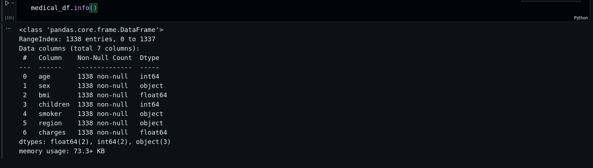
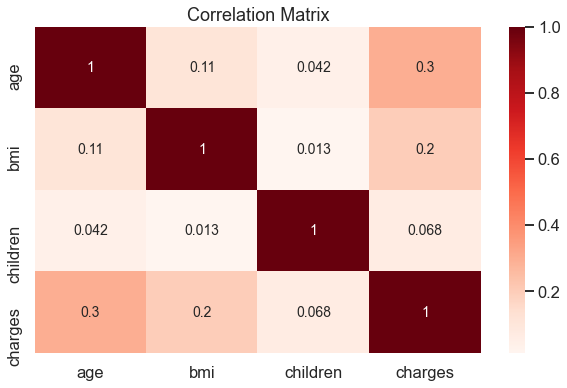
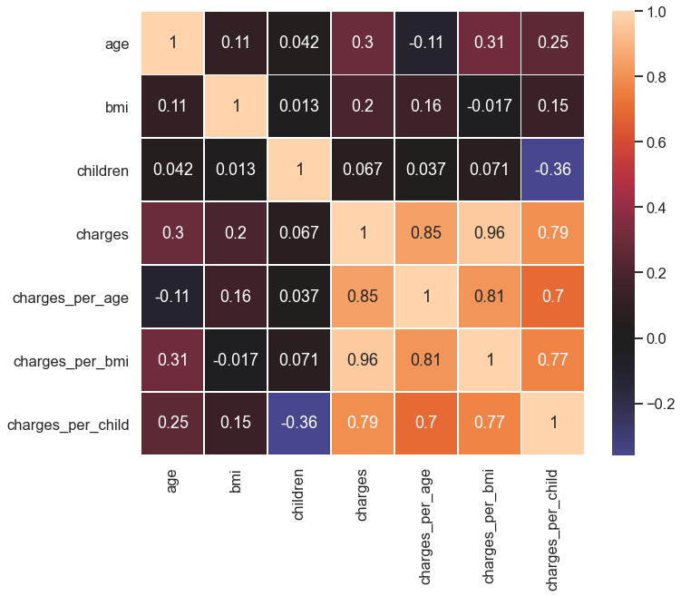
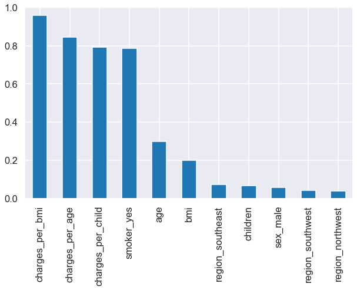

# Predicting Insurance Charges

An insurance company that provides affordable health insurance to customers all across the USA. As the lead data scientist at the company, your responsibility is to create an automated system that calculates the annual medical expenditure for new customers. The system will use various pieces of information such as age, sex, BMI, number of children, smoking habits and region of residence to estimate the medical expenditure. The estimate provided by the system will be used to determine the annual insurance premium offered to the customer. It is important to be able to explain why the system outputs a certain prediction due to regulatory requirements.

The objectives are two folds:

1. Predict the annual expenses of the insurance to each customer (Prediction)
2. Explain the reasoning behind the prediction (interpretability of the model)

## Environment

You can reproduce my local environment using the spec-file.txt or enviroment.yaml files with conda using the command:
`conda create --name myenv --file spec-file.txt` or `conda env create -f environment.yaml`

## Code:

Find a jupyter notebook for this work [here: part4](https://github.com/gkrampah/ML_project_regression/blob/main/part4.ipynb)

The bits on the data visualization can be found [here: part1](https://github.com/gkrampah/ML_project_regression/blob/main/part1.ipynb)

## Steps:

### Data Acquisition

The data was taken from [download CSV file here](https://raw.githubusercontent.com/JovianML/opendatasets/master/data/medical-charges.csv). It is a labeled data of $1337$ customers and $7$ features in total ($6$ predictors and $1$ target).

<figure>

<figure-caption>Summary of the data.</figure-caption>
</figure>

The

### Exploratory Data Analysis (EDA)

This first part includes:

1. Handling Missing Data or Nulls. There was no missing data.
2. Checking for Duplicates and fremoving them. There was a single duplicates which was remmoved
3. Checking for outliers using zscore but found no extreme values so no item was removed
4. Checking for skewness or distribution of the data. There was mild skewness of the data, so no transformations (log or box-cox etc) where applied to the features nor the target.

The data has both categorical and numerical columns and hence requires different treatment in the data preprocessing stage.

## Feature Engineering

### Numerical Features

Here, I examine the correlation between the different predictors and the target variables to see how informative they will be towards the prediction of my model. All these features show a weak correlation signaling their poor predictive power and hence a need to come up with new features.

<figure>

<figure-caption>Correlation matrix for the numeric variables</figure-caption>
</figure>

#### Feature Extraction

The new extracted features are highly correlated an hence informative.

<figure>

<figure-caption>Correlation matrix for the new feature engineered variables.</figure-caption>
</figure>

#### Feature Scaling

The numeric features are also scaled to improve the learning rate of our ML and AI models.

### Categorical Features

The **categorical features** were were one-hot encoded and their correlation with the target shown below:

<figure>

<figure-caption>Correlation matrix for the all variables (numeric and categorical)</figure-caption>
</figure>

There is still a weak correlation across all the original features except for "smokers_yes". Finally I show a bar plot of the correlation of all features with the traget variable, charges

<figure>

<figure-caption>Correlation value for the new feature engineered variables with the target variable, charges.</figure-caption>
</figure>

## Training Several Traditional ML Models and Evaluation Via Cross Validation for Prediction

Since the goal is not just about prediction but also interpretability, I started by considering interpretable models such as Linear regression and simple decision three and then proceed to a more complex model model, ensemble trees: RandomForest. I used these simple models to establish my baseline before using other complex models such as deep neural network.

- Models:

  1. LinearRegression
  2. SGDRegressor (to compare its performance to a batch approach of LinearRegrssion)
  3. DecisionTreeRegressor
  4. RandomForestRegressor
  5. LinearSVR

- Error Metric

  1. root mean squared error (rmse)

- Training:
  1. Split the data into train-test sets using $80-20\%$ splits. The `smoker_yes` has class imbalance of $80-20\%$ and so in the train-test split, I ensured this ratio is well represented by making a stratified split
  2. I applied cross-val technique on training the model with the training dataset. Then I calculated the validation/train error which was high for all this models. This signals a strong bias. RandomForest has the least validation error and hence was chosen. The validation error of the RandomForest model is $973$.
  3. Since the model shows a high bias, I increased the complexity of the model by applying a polynomial feature of order $2$. The new validation and generalization errors are $651$ and $1532$ respectively. Using this value as my baseline, I will build a neural network to beat this performance.

<!-- and its generalisation error is $728$. The $95\%$ -->

    <!-- confidence interval is $(544.66, 874.43)$ -->

## Bulding A Deep Neural Network For Prediction
I built a single and double hidden neural network with tensorflow and the generalization errors as $156.9$ and $239$ respectively. This a significant decrease from $1532$ in the case of RandomForest

## Business Insights and Interpretation of Model using Surrogates
